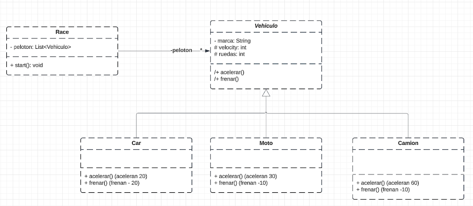

# Simulador de Carreras de Vehículos

## Descripción
Este proyecto es un simulador de carreras que incluye diferentes tipos de vehículos. Permite crear carreras con coches, motos y camiones, cada uno con sus propias características y comportamientos.

## Tabla de Contenidos
1. [Instalación](#instalación)
2. [Uso](#uso)
3. [Estructura del Proyecto](#estructura-del-proyecto)
4. [Características](#características)
5. [Contribución](#contribución)
6. [Autores](#autores)
7. [Licencia](#licencia)

## Instalación
1. Clone el repositorio: `git clone [URL del repositorio]`
2. Abra el proyecto en su IDE favorito que soporte Java.
3. Compile y ejecute la clase `Main`.

## Uso
Para iniciar una simulación de carrera:
1. Ejecute la clase `Main`.
2. Siga las instrucciones en consola para configurar la carrera y los vehículos participantes.

## Estructura del Proyecto - DIAGRAMA

## Estructura del Proyecto

### Clase Abstracta: Vehicle
- Atributos:
    - `Brand`: marca del vehículo
    - `Velocity`: velocidad actual del vehículo
    - `Wheels`: número de ruedas del vehículo
      - Constructor:
        public Vehicle(String Brand, int Wheels, int wheels) {
        this.Brand = Brand;
        this.Velocity = 0;
        this.Wheels = Wheels;
        }
- Métodos abstractos:
    - `acceleration()`: método abstracto para aumentar la velocidad
    - `deceleration()`: método abstracto para disminuir la velocidad

### Clase Car (hereda de Vehicle)
- Constructor:  
  public Car(String Brand, int Velocity, int Wheels) {
  super(Brand, Velocity, Wheels);
  }
- Métodos:
    - `acceleration()`: aumenta la velocidad en 20 unidades
    - `deceleration()`: disminuye la velocidad en 20 unidades

### Clase Motorbike (hereda de Vehicle)
- Constructor:
  public Motorbike(String Brand, int Wheels) {
  super(Brand, Wheels, Wheels);
  }
- Métodos:
    - `acceleration()`: aumenta la velocidad en 30 unidades
    - `deceleration()`: disminuye la velocidad en 10 unidades

### Clase Truck (hereda de Vehicle)
- Constructor:
  public Truck(String Brand, int Wheels) {
  super(Brand, Wheels, Wheels);
  }
- Métodos:
    - `acceleration()`: aumenta la velocidad en 30 unidades
    - `deceleration()`: disminuye la velocidad en 10 unidades

### Clase Race
- Atributos:
    - `participants`: lista de vehículos participantes
    - `distance`: distancia total de la carrera
- Métodos:
    - `addParticipant(Vehicle v)`: añade un vehículo a la carrera
    - `start()`: inicia la carrera
    - `updatePositions()`: actualiza las posiciones de los vehículos
    - `checkFinish()`: verifica si algún vehículo ha terminado la carrera

### Clase Main
- Función principal:
    - Crea instancias de diferentes tipos de vehículos
    - Configura y inicia una carrera
    - Gestiona la simulación de la carrera
  
## Características
- Simulación de carreras con diferentes tipos de vehículos
- Comportamientos únicos para cada tipo de vehículo
- Sistema de posicionamiento en tiempo real durante la carrera
- Interfaz de consola para interacción con el usuario

## Contribución
Si deseas contribuir al proyecto:
1. Haz un fork del repositorio
2. Crea una nueva rama (`git checkout -b feature/AmazingFeature`)
3. Realiza tus cambios y haz commit (`git commit -m 'Add some AmazingFeature'`)
4. Push a la rama (`git push origin feature/AmazingFeature`)
5. Abre un Pull Request

## Autores
- [Tu Nombre] - Trabajo Inicial - [Tu perfil de GitHub]

## Licencia
Este proyecto está bajo la Licencia MIT - ver el archivo [LICENSE.md](LICENSE.md) para detalles.
